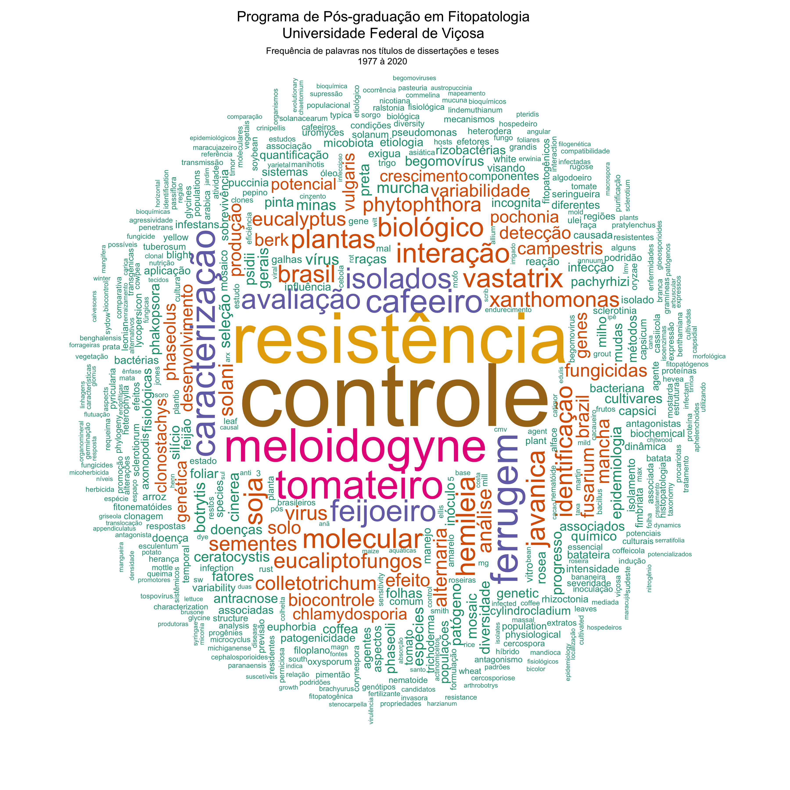

```{r setup, include=FALSE}
knitr::opts_chunk$set(include = FALSE)

library(janitor)
library(gsheet)
library(tidyverse)
library(crosstalk)
library(DT)
library(ggthemes)
library(plotly)
library(cowplot)
Sys.setlocale("LC_ALL", "pt_BR.UTF-8")


dat0 <- gsheet2tbl("https://docs.google.com/spreadsheets/d/1YfZlPXn9jwRfneV4j5lmNpRQcQh0LWc8/edit?gid=2097200067#gid=2097200067")

dat1 <- dat0 %>% 
  select(`Nome do egresso`, Nível, Defesa, Orientador, `Titulo Dissertação/Tese`) 


library(tidytext)

cbfito_words <- dat1 %>%
  filter(Defesa > 1976) %>% 
  unnest_tokens(word, `Titulo Dissertação/Tese`)
cbfito_words


cbfito_words %>%
  arrange(word) %>% 
  head(10)

cbfito_words %>%
    count(word, sort = TRUE) %>%
  mutate(word = reorder(word, n)) %>% 
  head(20)


stopwords_pt <- read_csv(
  file = "http://www.labape.com.br/rprimi/ds/stopwords.txt",
  col_names = FALSE
)
names(stopwords_pt) <- "word"


cbfito_words2 <- cbfito_words %>%
  anti_join(stopwords_pt) %>%
  anti_join(stop_words) # this is a list of English stopwords from the tidytext pkg
head(cbfito_words2)


cbfito_words2 %>%
    count(word, sort = TRUE) %>%
  mutate(word = reorder(word, n)) 


words_freq <- cbfito_words2 %>%
  filter(!word %in% c(
    "spp", "sp", "pv", "var", "br", "dois", "uso", "sacc", "sobre")) %>%
  count(word, sort = TRUE) %>%
  mutate(word = reorder(word, n))

```

```{r include=FALSE}

library(wordcloud)
library(RColorBrewer)
set.seed(100)
png("titulos.png", width=12, height=12, units="in", res=300)
words_freq %>%
  # filter(n > 5) %>%
  with(wordcloud(word,
    n,
    scale = c(8, 0.4),
    max.words = 500,
    min.freq = 1,
    random.order = FALSE,
    rot.per = 0.40, colors=brewer.pal(7, "Dark2")))
dev.off()

```

### Nuvem de palavras

Palavras mais frequentes nos títulos das dissertações e teses do Programa.


